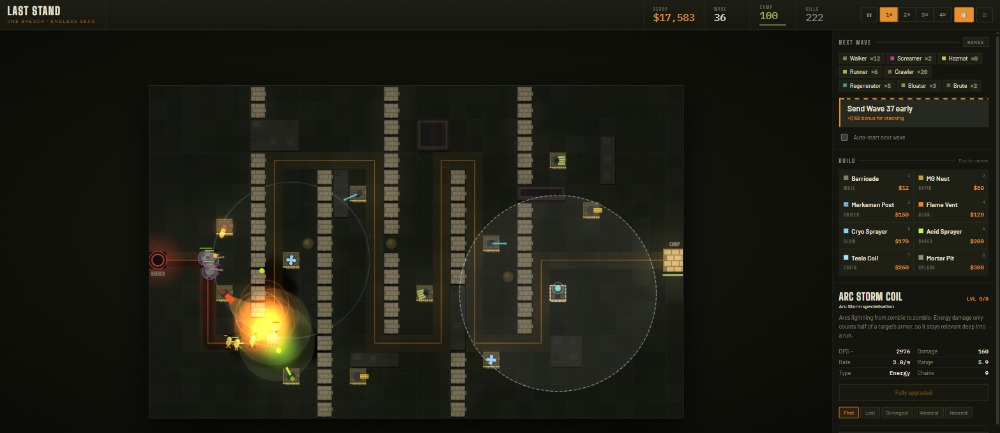
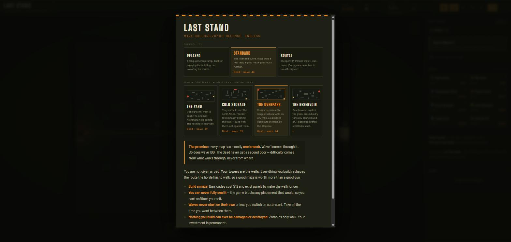
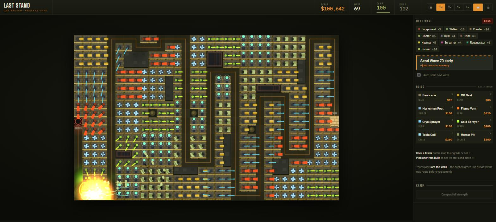
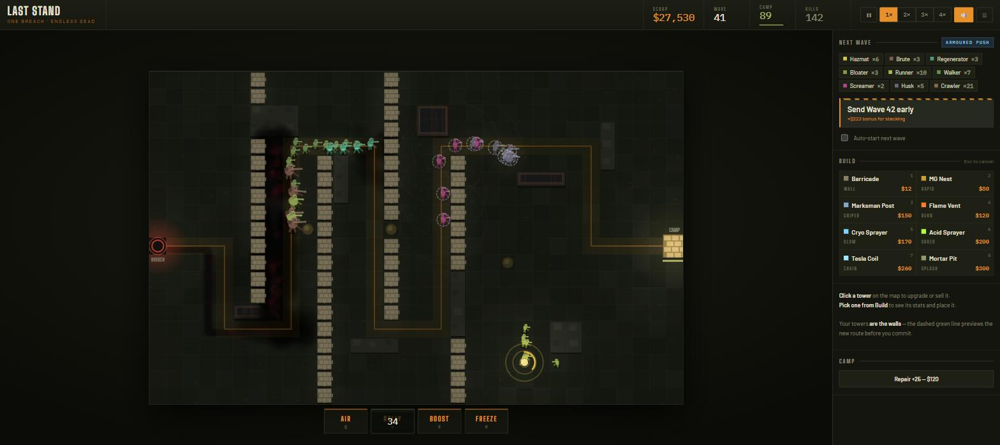
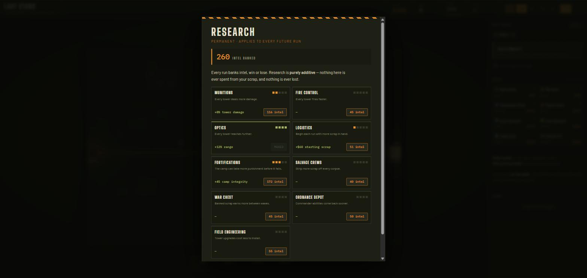
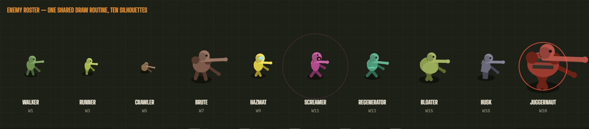

# LAST STAND

A maze-building zombie tower defense. Endless waves, deep upgrade trees, and
**exactly one spawn point — forever.**

### ▶ Play it: <https://devinjones521.github.io/last-stand/>



Vanilla JavaScript. **No dependencies, no build step, no framework** — ES modules,
Canvas 2D, WebAudio, ~6,000 lines. Runs offline as an installable PWA; on Android
or iOS, open the link and choose **Add to Home Screen**.

<table>
<tr>
<td width="50%"><br>
<sub><em>Four maps, one breach on each. Best runs are per map and difficulty.</em></sub></td>
<td width="50%"><br>
<sub><em>Stress test: every buildable cell filled. 459 towers, 5.3ms/frame.</em></sub></td>
</tr>
</table>

### What's interesting in here

- **Flow-field pathfinding** — one BFS from the camp reprices the whole board, so
  repathing 130 zombies after you drop a wall is free, and "would this wall trap
  the horde?" becomes a single reachability check. [↓](#why-a-flow-field-instead-of-a)
- **The maze is emergent, not authored.** Towers *are* the walls; the game refuses
  any placement that would seal the route, so you can't softlock yourself.
- **A headless test suite** that runs the real simulation in Node with no DOM —
  250+ checks including a measured difficulty curve — plus a **seeded fuzzer**
  that plays randomly and asserts the rules hold after every action. It found a
  real bug. [↓](#testing)
- **Layered Canvas renderer** with baked terrain, an accumulating decal layer, and
  a night lighting pass. [↓](#how-the-battlefield-is-drawn)
- **A pinch-zoom camera that costs nothing when unused** — one transform, clamped
  so 1× is provably the identity. [↓](#the-camera)
- **A walkthrough with no scripted click path** — every step is a predicate over
  game state, so it can't be got stuck and replays from wherever you are.
  [↓](#teaching-it)
- **Deterministic waves** — wave 37 is identical every run, so it can be learned.
- **Four maps that move the breach without ever adding one.** [↓](#maps)
- **Playable with no pointer at all** — the board is a focusable widget with a
  cell cursor and live descriptions for screen readers. [↓](#playing-without-a-pointer)

## Run it locally

```bash
npm start     # http://localhost:8080
npm test      # headless simulation suite
npm run fuzz  # random-play invariant fuzzer
npm run icons # regenerate app icons
```

No dependencies and no build step. The server is a ~40-line static file server;
it only exists because ES modules can't load over `file://`. The service worker
is deliberately **not** registered on localhost, so local edits are never
shadowed by a stale cache.

---

## The design promise

This game was built around one specific complaint: tower defense games get
frustrating when they start opening extra spawn points as the difficulty ramps.

So it never does. Every map has **exactly one breach**. Wave 1 comes through it.
So does wave 100. Difficulty scales through what walks through the gap — tougher
bodies, nastier archetypes, tighter spacing — and never through where it comes
from. Picking a different map moves the breach; it never adds a second one.

Three more rules follow from the same idea:

- **Nothing you build can be damaged or destroyed.** No zombie in the game
  attacks a tower. Every enemy ability makes the horde harder to *kill*, never
  harder to *build*. Your investment is permanent.
- **Waves never start on their own** unless you tick auto-start. Take an hour
  between waves if you want.
- **You can never seal yourself in.** Any placement that would fully block the
  route is refused, with the reason shown on the map. You cannot softlock.

---

## How it plays

You get an open field, not a road. **Your towers are the walls.** Every building
reshapes the path the horde has to walk, so the shape of your maze matters more
than any single gun.

Barricades cost $12 and do nothing but stand in the way — click-drag to lay a
whole run at once. While you're holding a tower, a dashed green line previews
the new route *before* you spend anything.

Cash banked at the end of a wave earns 5% interest (capped at $150), so saving
for one big upgrade genuinely beats dribbling it into chaff.

You can call the next wave while the last one is still on the field, and get
half its clear bonus immediately for the risk. Up to **three waves** can be in
flight at once; past that the button tells you to clear some ground first.

### Commander abilities

Four powers on cooldowns, bound to <kbd>Q</kbd> <kbd>W</kbd> <kbd>E</kbd> <kbd>R</kbd>.
They **never cost scrap** — only time — so they add to what you can do without
ever competing with building up your defenses.



| | Ability | Does |
|---|---|---|
| <kbd>Q</kbd> | **Airstrike** | Shell onto a point you pick. Damage is partly a fraction of max HP, so it never falls off late. |
| <kbd>W</kbd> | **Rally Flare** | The horde walks to the flare instead of your camp — drag them back through your maze for another lap. |
| <kbd>E</kbd> | **Overcharge** | Every tower fires 60% faster and hits 35% harder for 8s. |
| <kbd>R</kbd> | **Cryo Burst** | Freezes the whole field, then leaves it crawling. Panic button. |

The flare is the interesting one mechanically: it computes a **second flow
field** aimed at the flare instead of the camp, and enemies follow whichever
field applies to them — falling back to the camp field where the flare isn't
reachable, so nothing can ever be stranded. Since towers are walls, a
well-placed flare can walk the horde through your whole maze twice.

### Research (meta-progression)



Every finished run banks **intel** — win or lose, you always earn something.
Intel buys permanent research across nine tracks that applies to every future
run: tower damage, fire rate, range, starting scrap, camp integrity, kill
payouts, interest, ability cooldowns and upgrade costs.

The design rule is that research is **purely additive**. A player with no
research gets exactly the balance the game shipped with — nothing was nerfed to
justify a tree, and nothing is ever lost. Measured by the test suite: an
identical build reaches **wave 29 with no research and wave 44 fully maxed**, and
a wave-40 run banks ~150 intel against a first node level costing 30–55.

### Maps

Four boards, picked on the title screen alongside difficulty. Each one has one
breach and one camp; what changes is **where the breach sits** and what permanent
terrain stands between it and you.

| Map | Breach → camp | Natural walk\* | The problem it poses |
|---|---|---|---|
| **The Yard** | west → east | 32 | Open ground. Nothing to hide behind and nothing in your way. |
| **Cold Storage** | north → south-east | 32 | Freezer rows already channel the walk — build with them, not against them. |
| **The Overpass** | corner → corner | 49 | The longest natural walk. A collapsed span cuts the field on the diagonal. |
| **The Reservoir** | east → west | 43 | Runs against the grain, around a dry tank you can't build on. |

\* route length in cells with nothing built, measured by the test suite.

The interesting part is what *didn't* change. An identical camp-adjacent gun
line reaches **wave 29 on all four**, so the map picker is a different maze
problem, not a second difficulty slider. Best runs are recorded per **map and
difficulty together** — wave 40 on The Overpass isn't the same achievement as
wave 40 on The Yard.

Map data is one object per board (`src/maps.js`), and the title screen's
thumbnails are SVG generated from that same data, so a preview can't drift out
of sync with the board it's advertising. The suite checks every map for a
reachable route, terrain inside the board, a breach and camp that aren't buried
under rubble, and that the seal rule still can't be beaten.

### Difficulty

Picked per run on the title screen. The whole curve moves together — enemy HP,
your income, and how much camp you can afford to lose.

| | HP curve | Start | Camp | Same build reaches* |
|---|---|---|---|---|
| **Relaxed** | `1.062^w` | $450 | 150 | wave 53 |
| **Standard** | `1.075^w` | $300 | 100 | wave 39 |
| **Brutal** | `1.088^w` | $250 | 80 | wave 21 |

\* measured by the test suite running one identical maze + gun line on each
setting, reinvesting all income between waves. Your best run is recorded per
difficulty.

### Controls

| Key | Action |
|---|---|
| `1`–`8` | Pick a tower to build |
| Click | Place it, or click a placed tower to inspect |
| Click-drag | Lay a run of barricades |
| Right-click / `Esc` | Cancel build mode |
| `Enter` | Send the next wave |
| `Space` | Pause |
| `S` | Cycle speed 1× → 2× → 3× → 4× |
| `U` / `X` | Upgrade / sell the selected tower |
| `A` | Toggle auto-start |
| Scroll / `+` `−` | Zoom the board (`0` fits it back) |
| Middle-drag | Pan when zoomed in |
| `Tab` | Focus the board for keyboard play |
| Arrows / `Shift`+arrows | Move the board cursor (5 cells with Shift) |
| `Enter` on the board | Build, or inspect what's under the cursor |

On a touch screen: **pinch to zoom**, two fingers to pan, and one finger to drag
the board around once you're zoomed in. Tapping and dragging out a barricade run
work the same at any zoom.

---

## Towers

Eight towers, eight levels each. Levels 1–3 follow the tower's base curve;
buying level 4 forces a permanent **specialisation choice** that changes both
the stats and the mechanics for levels 4–8.

| Tower | Cost | Role | Specialisations |
|---|---|---|---|
| Barricade | $12 | Pure wall (3 levels) | — razor wire, then electrified |
| MG Nest | $80 | High volume, low damage | **Gatling** (spins up to +190% fire rate) / **Shredder** (pierces through ranks) |
| Marksman Post | $150 | Slow, huge single hits | **Anti-Materiel** (ignores armour entirely) / **Headhunter** (crits + executes) |
| Flame Vent | $120 | Short cone, burn DoT | **Napalm** (leaves burning ground) / **Incinerator** (stacking burn vs. big HP) |
| Cryo Sprayer | $170 | Radius slow | **Deep Freeze** (freezes solid) / **Frostbite** (chilled enemies take more damage from everything) |
| Acid Sprayer | $200 | Armour shred | **Dissolver** (huge stacking shred) / **Caustic Cloud** (lingering pools) |
| Tesla Coil | $260 | Chain lightning | **Arc Storm** (many long jumps) / **Overcharge** (one huge stunning zap) |
| Mortar Pit | $300 | Long-range splash | **Cluster** (bomblet spread) / **Bunker Buster** (permanently destroys armour) |

Damage types matter: **physical** and **explosive** are blunted by armour,
**energy** only counts half of it, and **fire** and **acid** ignore armour
completely (which is also what shuts off a Regenerator's healing).

Each tower has a targeting priority — First, Last, Strongest, Weakest, Nearest.
"First" and "Last" are exact, not approximate: they read straight off the flow
field's distance-to-camp.

## Zombies

| Enemy | From | What makes it annoying |
|---|---|---|
| Walker | 1 | Baseline |
| Runner | 3 | Fast, fragile |
| Crawler | 5 | Very fast, swarms |
| Brute | 7 | Heavy armour |
| Hazmat | 9 | Immune to all burn and acid DoT |
| Screamer | 11 | Buffs nearby zombies' speed and resistance |
| Regenerator | 13 | Heals constantly unless burning or corroded |
| Bloater | 15 | Death cloud armours everything nearby |
| Husk | 18 | Cannot be slowed, chilled or frozen |
| Juggernaut | every 10 | Boss. Massive HP, immune to stun and freeze |

Waves are **deterministic** — wave 37 has the same composition every run, so you
can learn a run and plan for it.



---

## Code layout

```
index.html            shell
server.js             zero-dependency static server
manifest.webmanifest  PWA metadata
sw.js                 service worker (offline)
fonts/                self-hosted woff2 — no CDN, works offline
icons/                generated PNG app icons
tools/
  generate-icons.mjs  draws the icons (hand-rolled PNG encoder, no deps)
  sim-test.mjs        headless simulation suite — npm test
  fuzz.mjs            seeded random-play invariant fuzzer — npm run fuzz
src/
  config.js         ALL balance numbers, difficulties, colours
  maps.js           the four boards: breach, camp and permanent terrain
  towers.js         tower defs + upgrade/branch trees
  enemies.js        enemy defs + per-wave scaling
  waves.js          deterministic wave generation
  pathfinding.js    flow-field BFS (see below)
  viewport.js       zoom/pan camera (see below)
  cursor.js         keyboard control of the board (see below)
  tutorial.js       first-run coaching steps (see below)
  game.js           simulation: state and rules, no drawing
  render.js         all canvas drawing, no state mutation
  ui.js             DOM sidebar, panels, overlays
  audio.js          synthesised SFX (no asset files)
  main.js           input, frame loop, wiring
  styles.css        design tokens + the whole interface
```

### Testing

`npm test` runs the real `Game` class headlessly in Node — no DOM, no browser.
It covers the seal rule, maze rerouting, full combat, every tower maxed, both
branches of each, damage attribution, deterministic waves, the difficulty
spread, every map, and save/load (including migrating v1 saves). A 40-wave run
simulates in well under a second, which is also the performance check.

**`npm run fuzz`** is the other half. The suite above checks that correct play
gives correct results; the fuzzer checks that no sequence of legal-but-stupid
actions can reach a state the game shouldn't allow. It hammers every public
mutator in random order — building on terrain, selling mid-wave, aiming
abilities off the board, passing branch ids that don't exist, save/load round
trips mid-flight, restarting after a loss — and asserts a set of invariants
after **every single action**:

- the horde can always still reach the camp (nobody has sealed themselves in)
- no tower on terrain, the breach, the camp, or on top of another tower
- `towerAt` and `towers[]` always agree
- no dead enemy still in the list, nothing off the board, nothing at `NaN`
- cash never negative, camp never above max, phase always one of three

It's seeded, so a failure replays exactly. The last sweep was **250 games and
1,080,913 random actions across every map and difficulty, with no violations**.

The suite also checks that the fuzzer *can* fail: it feeds `invariants()` ten
deliberately broken states and requires all ten to be caught. A detector that
can't fire would otherwise report success forever.

That's how the wave-stacking bug below was found.

#### What the fuzzer caught

Calling the next wave early is a real mechanic — but nothing bounded how many
waves could be in flight at once, and the `Enter` shortcut had no auto-repeat
guard. A **held Enter key** fires about thirty times a second, so:

| Enter held for | Waves in flight | Enemies | Frame cost |
|---|---|---|---|
| ~0.3s | 10 | 100 | 1.7ms |
| 1s | 30 | 386 | 6.1ms |
| 2s | 60 | 1,199 | **96ms** |
| 3s | 90 | 2,608 | **214ms** |

Two seconds of a stuck key took the game to 10fps and handed out ~$9k of
early-call bonuses on the way. Fixed by ignoring auto-repeat on every shortcut
(they're all discrete actions) and capping concurrent waves at
`BALANCE.maxConcurrentWaves`, which is 3 — comfortably more than the mechanic
was ever meant to allow. The same 90 presses now land 3 waves at 1.3ms/frame,
and the button says *"3 waves in flight"* rather than silently doing nothing.

### Visual identity

Field-expedient military and quarantine signage: stencilled crates, hazard tape,
olive-drab kit. Signal amber (`#e8912a`) is the single accent; olive-drab and
oxide red carry "holding" and "danger" so semantic colour never competes with
it. Squared 2px corners and hairline rules instead of floating rounded cards.
Type is Big Shoulders Display (stencil/display), Barlow (body), and IBM Plex
Mono (every numeral, tabular) — all self-hosted under the OFL.

It commits to a single dark theme on purpose; there is no light mode, and every
colour is painted explicitly so nothing borrows a host background.

### How the battlefield is drawn

Four layers composite each frame, all plain Canvas 2D:

1. **Terrain** — baked once at device resolution into an offscreen canvas.
2. **Decals** — a second offscreen canvas that is only ever *added* to. Blood
   pools, mortar scorch and the track the horde wears into the dirt accumulate
   there permanently, so a wave-40 battlefield looks nothing like a fresh one.
   The sim pushes marks onto `game.decals`; the renderer drains that queue.
3. **The world** — route, towers, then zombies depth-sorted by `y`.
4. **Lighting** — darkness is filled over everything, then punched back out
   with `destination-out` around each light (camp floodlights, the breach,
   engaged towers, fires, muzzle flashes), followed by an additive warm bloom.
   Lights use one cached radial sprite rather than per-frame gradients.

Night is kept at only 38% opacity on purpose: a tower defense has to stay
readable across the whole board, so legibility beats mood.

Zombies share a single draw routine parameterised per archetype (`BODY` in
`render.js` — torso width, head size, reach, stride speed, lean, plus flags like
`legless`, `visor`, `maw`, `plates`). One renderer, ten distinct silhouettes.

### Teaching it

The one idea a new player has to get is that **the towers are the walls** — that
you're drawing the route, not decorating one. The title screen says so and
nobody reads it, so a first run is coached one line at a time instead.

Every step is a **predicate over real game state**, never a scripted click path:

```js
{ id: 'wall',
  title: 'Drag out a wall',
  body: 'Hold and drag to lay a whole run at once…',
  done: (g) => g.towers.filter((t) => t.stats.inert).length >= 6 }
```

That one decision buys most of the good behaviour. There is no wrong move and
nothing to get stuck behind — a player who ignores the panel and builds their
own maze satisfies the steps anyway. Any step **already satisfied when it comes
up is skipped silently**, which is also what makes it replayable: open the
walkthrough again on a wave-20 board and it picks up at whatever you genuinely
haven't done yet, rather than telling you to place your first barricade.

It's checked once per frame, redraws only when the step actually changes, and is
dismissible for good. The suite drives all six steps by mutating the real
`Game` — including that five barricades don't count as a maze and six do.

### Playing without a pointer

Every other verb in the game already had a key — pick a tower, send a wave, fire
an ability, zoom. The one thing that needed a pointer was the central act of
putting a tower somewhere, which meant the game simply couldn't be played
without a mouse or a touchscreen.

The board is now a focusable widget. <kbd>Tab</kbd> to it, arrows move a cell
cursor (<kbd>Shift</kbd> jumps five), <kbd>Enter</kbd> does whatever a click
would have done there — build, inspect, or drop an airstrike.

The interesting problem was <kbd>Enter</kbd>, which already meant "send the next
wave". Rather than move it, **focus disambiguates**, the way the web already
does it: with the board focused Enter acts on the cell, otherwise it sends the
wave. Nothing was taken away, and nothing changed for a player who never presses
Tab.

Focus alone isn't quite the test, though — clicking the canvas focuses it too,
and a mouse player should see none of this. So the board also has to have been
*reached by keyboard*, tracked explicitly rather than leaning on a `:focus-visible`
heuristic. Click the board and Enter still sends waves; Tab to it and it doesn't.

It's driven by polling focus once a frame rather than by `focus`/`blur` events,
which don't fire reliably when the document itself isn't focused — that left a
focused board with no cursor, and Enter falling through to sending a wave.

For screen readers, an `aria-live` region describes each cell as the cursor
enters it, leading with what's there rather than where it is:

> *"Gatling Nest, level 6. column 12, row 9."*
> *"Rubble — cannot be built on. column 6, row 2."*
> *"Open ground, on the route. column 14, row 10."*

The cursor draws as corner brackets over a dark under-stroke, last of
everything — it shares its square with the build ghost, and under it the red
"can't build here" fill swallowed it completely.

### The camera

32 columns across a phone puts a cell at about 12px — half a fingertip, and the
main reason the game didn't really work on a phone. So the board can be pinched
in to 4.5×, which takes that cell to roughly 56px.

The camera is deliberately shaped so the zero case is free:

- **Zoom never goes below 1× and the pan is always clamped inside the board**, so
  the board always fills the frame and there is no letterboxing to draw around
  at any zoom. At rest it is the identity transform — the desktop view is
  exactly what it was before the camera existed.
- It's applied as **one transform at the top of the frame**, so every draw
  routine still works in world coordinates and none of them know it exists.
  Shake is divided back down by the zoom and the impact punch scales about the
  centre of the *view*, so a kick is the same number of screen pixels however
  far in you are.
- Input runs the same transform backwards, so a tap, a barricade drag and an
  airstrike all land on the cell actually under the finger. The suite checks
  that a screen point survives the round trip, and that abilities land on the
  aimed cell at 1×, 2.5×, 3.2× and 4.5×.

One thing did fall out of it: the baked tower layer is a 1024×640 bitmap, so
magnifying it just magnifies its pixels — sandbags went soft while the turret
drawn live above them stayed sharp, which reads as a bug. Past 1.25× the static
art is drawn live instead, and it costs almost nothing, because the further in
you zoom the fewer towers are on screen. On a filled 544-tower board: **1.9ms at
1×, and 2.9ms at the worst-case 2×**.

### Game feel

The impact layer is deliberate rather than incidental:

- **Hit flash** — bodies blow out toward white for 70ms when struck. Skipped for
  fire and acid, which tick every frame and would otherwise leave enemies
  permanently white.
- **Hit stop** — heavy impacts (boss deaths, airstrikes) freeze the entire
  simulation for ~90ms. The clock genuinely stops; the snap back is the point.
- **Knockback** — a render-only offset, clamped to 9px total. It never moves the
  unit in the simulation, so it cannot push anything off its route.
- **Camera punch** — a scale kick about the board centre, separate from shake.
- **Turret recoil**, **ejected brass**, **debris chunks with spin**, and a **pop
  ring** on each kill so deaths read even in a packed corridor.
- Scrap **counts up** to its value rather than snapping, so a wave payout lands
  as an event.

Static tower art (emplacements, sandbags, level pips, barricades) is baked into
its own layer and only re-drawn when the tower set actually changes, tracked via
`game.buildVersion`. Each frame then costs one `drawImage` plus the rotating
turrets. Redrawing it live was ~20 fill operations per tower per frame.

Whole-frame cost with 60+ towers and a live wave is about **1.7ms**, against a
16.7ms budget. A pathological 459-tower board — every buildable cell filled —
runs at **5.3ms** (~188fps); before the tower-art bake it was 22.7ms (~41fps).

### Why a flow field instead of A*

Rather than pathing each zombie individually, a single BFS runs outward from the
camp whenever the maze changes, giving every walkable cell its distance-to-camp.
Zombies just walk downhill. That makes three things fall out for free:

- repathing 130 zombies after you drop a wall costs nothing
- "would this placement seal the route?" is just "is the spawn still reachable?"
- drawing the route preview is just walking downhill from the spawn

### Tuning

Everything balance-related is in `src/config.js` — the HP curve
(`hpLinear` / `hpExpo`), payouts, interest, wave budget, the enemy body cap.
Tower numbers are in `src/towers.js`.

For reference, the HP curve is
`(1 + 0.10·(w−1)) · 1.075^(w−1)`, which puts wave 30 at ~33× a wave-1 zombie and
wave 60 at ~530×.

### Dev hooks

With the page open, the console has `__game` and `__dev`:

```js
__game.cash = 99999
__game.speed = 3
__game.wave = 40          // jump the scaling
__game.startWave()
```

Saves live in `localStorage` under `laststand.save.v1` and autosave on each wave
clear.

---

## Licence

Source code is MIT — see [LICENSE](LICENSE).

The bundled fonts in `fonts/` are third-party, redistributed under the SIL Open
Font License 1.1 — see [fonts/LICENSE.md](fonts/LICENSE.md).

All art is drawn procedurally at runtime with Canvas 2D; there are no image
assets in the project except the app icons, which are generated by
`tools/generate-icons.mjs`.
